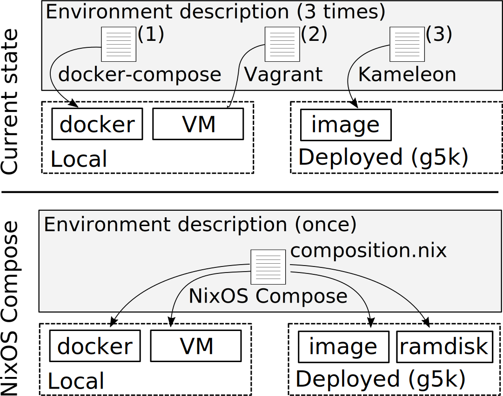

```admonish warning
This documentation is being written on a project under development. Recent changes or mistakes can occur.
```

*NixOSCompose* generates and deploys reproducible distributed environnement, with a focus on the software stack.

<!-- build and deploy config and software stack on different target platform with a focus on reproducibility -->
<!-- parler environment + configuration (service, ssh key, ) ; deployable on different target platforms -->
# Introduction

## Presentation

*NixOSCompose* is a tool designed for experiments in distributed systems. It generates reproducible distributed environments. Those can then be deploy either in virtualized or physical platform, respectively for local and distributed deployments. It inserts itself in the development cycle of the environments and uses to the notion of transposition to make it faster and easier. The intended workflow is to have fast iteration cycle on a local virtualized distributed system and once the configuration is complete it can be used for physical deployment.

```admonish abstract title="Transposition"
Enables users to have a single definition of their environment and to deploy it to different platforms. instead of maintaining multiple configuration for each targeted platforms we are using only one declarative description (called `composition`).



```

The command line tool provides a similar interaction between the different targeted platforms that we call *flavours*.

## [NixOS](https://www.nixos.org)

As seen in the name of the project, NixOS plays an important role here. We exploit the declarative approach for system configuration provided by the NixOS Linux distribution. We also rely on the reproducibility provided by the Nix package manager which helps in the sharing and rerun of experiments.

# Current support

Right now *NixOSCompose* is still in early stage of development, it supports the following list of flavours.

- local flavours
    - nixos-test
    - docker-compose
    - vm-ramdisk (qemu VMs)
- distributed flavours
    - g5k-image
    - g5k-ramdisk